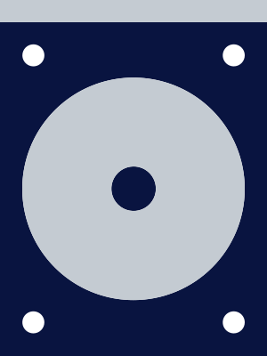

# { .dcr-icon } Security

This page provides a list of things you can do to improve your security when working with DCR, or cryptocurrencies more generally.

This list is not meant to be comprehensive, and does not offer any guarantees, only ideas. 

## System setup

Here are some measures you can take when setting up your hardware and software to make your system more secure. 

- **Disk encryption:** Nearly all Operating Systems (OSes) support disk encryption of some kind. While not an ultimate protection, it does help. Note that a sophisticated adversary can extract your disk encryption keys from your device's RAM if they can access your machine while powered on. 

- **Remove unnecessary software:** Every installed piece of software increases the attack surface of the system, as it could contain exploits or vulnerabilities. If you have a substantial amount of cryptocurrency on your machine, you should remove all unnecessary software. 

- **Run an open source OS:** While many people use Windows or Mac for their operating system, it is impossible to know what these OSes are doing at all times if the corresponding source code is closed. Running an open source OS (e.g. Linux variants, *BSD) gives you some assurance that your sensitive information, including wallet keys, is not being sent to a corporate or government server.

- **Run Qubes:** Qubes is the only OS that uses the on-board IOMMU (memory management unit) to partition the networking devices from the OS main memory by default on hardware that supports it. Qubes is also very convenient for creating single-purpose virtual machines, called “AppVMs”, that are nearly ideal for use with cryptocurrency applications.

- **Buy all computer components in person:** TLAs have been shown to intercept computer hardware in transit and implant malware of various sorts. Buy all computers and components in person at a store near you to avoid this.

- **Disable ME or similar:** Since 2006, all Intel CPUs have shipped with a co-processor called the Intel Management Engine (ME). This coprocessor has full access to the system, including system memory, screen, keyboard and network. Some agencies within the United States Government (USG) [disable ME](https://www.csoonline.com/article/3220476/researchers-say-now-you-too-can-disable-intel-me-backdoor-thanks-to-the-nsa.html), as it presents a security vulnerability. While Intel does not officially support disabling of ME, individuals can use tools such as [me_cleaner](https://github.com/corna/me_cleaner) to manually remove it. 

- **Electromagnetic shielding:** It has been known for decades that monitors and LCDs can be monitored remotely via a process known as “Van Eck phreaking”. Keyboards have been shown to leak EM signals that can be read 10s of meters away, even through walls. Nation state government militaries and intelligence services have used EM shielding as a countermeasure since the 1960s or earlier.

## Operations security (OPSEC)

Once you have a secure system set up, here are some operational security measures you can take when running your system.

- **Limit physical access to hardware:** Physical access is king, so don’t let attackers get physical access to it. If possible, store your machine in a locked room with strictly limited access.

- **Avoid using your machine in public places:** This advice extends to the fiat banking world as well. When computing in public, you cannot control the presence of other parties, their computing devices, surveillance cameras, etc.

- **Keep mobile devices away from your machine:** Modern phones and tablets have multiple microphones and can pick up audio from 20-30 feet away. Keep your mobile devices in a separate room while entering sensitive information into your machine (e.g. wallet seeds, passwords and passphrases).

- **Only run dcrwallet on ticketbuying machine:** dcrd, the consensus daemon, necessarily communicates with a variety of peers on the public internet. Run dcrwallet on a locked-down machine and have it connect to a remote dcrd to minimize traffic going to or from your secure machine.

- **Audit your traffic:** Using Commercial-off-the-shelf (COTS) gear, you can audit network traffic to and from your computer down to [Layer 2](https://en.wikipedia.org/wiki/Layer_2) (the layer where data packets are encoded and decoded into bits). Keep in mind that you cannot audit most Transport Layer Security (TLS) traffic offline because of how ephemeral keys are used.

