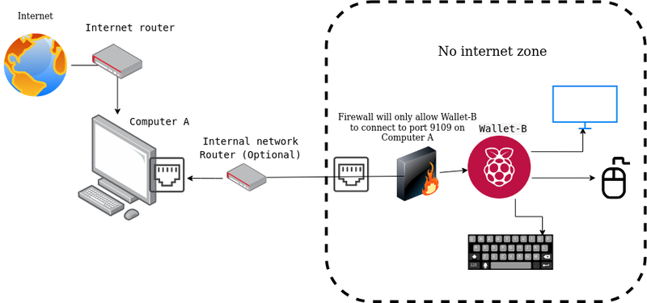

#  Secure Cold Wallet Setup

Last updated for CLI release v{{ cliversion }}.

---

This is a guide for securely holding your Decred.
The system described here uses two computers:

* `Computer-A` - The Node

    A laptop or desktop that will be running the dcrd node.
    Connects to the public internet and is expected to remain online most of the time.

* `Wallet-B` - The Wallet

    A secure system that will be running the wallet.
    Should never connect to the public internet, and can remain offline and powered off most of the time.

The guide assumes some general technical knowledge, and that users know how to
enter commands on a terminal.
This guide uses the more technical CLI-based Decred software, but it would be
possible to use a GUI for Wallet B and still maintain similar security.


Although focused on Decred and Raspberry Pi, this guide can also be used for
more general hardware devices and almost any cryptocurrency.
This guide also gives instructions and commands specific to Debian/Linux
systems, but the principles/tools can be applied to almost any OS.

Because firewalls can be complex and difficult for beginners, this guide assumes
that users have zero familiarity with firewalls.
The instructions here will explain how to set up a simple (but strong and
sufficient) software firewall that isolates `Wallet-B` from the public internet.

---

## Scope and Limitations

The scope of this guide is to secure your cryptocurrency holdings from common malware and light threats.
The wallet setup in this guide is generally known as a “cold wallet”.
If you are a normal cryptocurrency holder and follow this guide exactly, it should give a good level of security.

**This setup will not protect you against a state-level attacker or a persistent threat.**

[General Security](general-security.md) offers more techniques to keep your system secure.

---

## The Setup



### Benefits of this Setup

* `Wallet-B` is kept offline and turned off most of the time.
  This greatly reduces attack surface/opportunity.
* An attacker would have to compromise dcrd on `Computer-A` first, and then find
  a way to break into `Wallet-B` using the RPC to compromise and steal your
  wallet data.
  This is highly unlikely and difficult to pull off.
* dcrd on `Computer-A` can be used for other purposes in your local network (eg. other wallets, DEX, etc),
  so you don't need to maintain multiple dcrd instances within your local network.
* Even though `Wallet-B` is kept offline, it’s still possible for it to participate in staking by using a VSP.
* Advanced readers can extrapolate from this guide and make `Wallet-B` a “hot”
  wallet so they can Solo Stake, but that’s significantly more vulnerable to
  attacks and outside the scope of this guide.

### Hardware

#### Computer-A - The Node

In general, you can use almost any computer to run the node
(see the [Minimum Recommended Specifications](https://github.com/decred/dcrd#minimum-recommended-specifications-dcrd-only) for dcrd).
`Computer-A` is expected to remain online most of the time, but it's not required.
For a budget device with a low energy requirement, it’s fine to use a Raspberry
Pi, but keep in mind that your device also needs to run an operating system.
Many people choose to run nodes on the 4 GB models of Raspberry Pi’s, using a
lightweight OS.
It would also be fine to use an old laptop or desktop.
This guide assumes users are aware that since `Computer-A` is connecting to the
public internet, it is potentially vulnerable to attacks.

#### Wallet-B - The Wallet

Since the wallet needs to have the utmost security in this setup, it’s important
to have a minimal attack surface.
This guide suggests that this wallet be a cold wallet, i.e. powered off most of the
time.
It is nearly impossible to attack a system which is powered off.
This guide suggests using a Raspberry Pi for the wallet, although other hardware
can be used.

**Finally, this guide suggests using a mouse, keyboard, and monitor to access each device.**

### Operating Systems

Since `Computer-A` is not storing any sensitive information, the choice of operating system is less important than the choice for `Wallet-B`.
dcrd can be installed on anything from Windows to Mac to Linux to OpenBSD.
However, using Linux or OpenBSD should be considered to reduce your attack surface.

This guide assumes you already have an operating system on `Computer-A`, and won’t describe how to install a new one.

`Wallet-B` will be the more secure device.
Use an operating system you feel comfortable with.
Consider using Linux or OpenBSD to reduce your attack surface.
Raspbian works fine if you want a GUI, and Ubuntu Desktop is another good choice for beginners who don’t need a GUI.

This guide will give commands specific to Debian/Linux based systems.
All details/commands that come within curly braces `{}` cannot be copy-pasted -
you will need to remove the curly braces and edit the command to suit your setup.

### Setting up Computer-A

!!! warning "If you use dcrwallet on this system, do not use the same seed and/or password on `Wallet-B`"

1. Use [dcrinstall](../wallets/cli/cli-installation.md) to install Decred binaries and config files.

1. Use `ifconfig` to find the IP address of `Computer-A` on your local network.

1. Start dcrd on `Computer-A`, ensuring it exposes RPC to the local network.

    ```no-highlight
    dcrd --rpclisten={LOCAL_IP_OF_COMPUTER-A}
    ```

    Let dcrd fully sync to the latest block.

1. Create a folder which will be copied over to `Wallet-B`.
    Copy the dcrd certificate and config into that folder.

    ```no-highlight
    mkdir ~/copytob
    cp ~/.dcrd/rpc.cert ~/copytob
    cp ~/.dcrd/dcrd.conf ~/copytob
    ```

1. Download the Decred binaries release for your `Wallet-B` OS from
    [GitHub](https://github.com/decred/decred-binaries/releases/tag/v{{ cliversion }})
    and place it in the same folder.

    **Note:** it's recommended that you don't use `dcrinstall` again on `Wallet-B`,
    since it would generate new `*.cert` and `*.conf` files which are not
    compatible with `Computer-A`.

    ```no-highlight
    wget -P ~/copytob https://github.com/decred/decred-binaries/releases/download/v{{ cliversion }}/decred-linux-arm64-v{{ cliversion }}.tar.gz
    wget -P ~/copytob https://github.com/decred/decred-binaries/releases/download/v{{ cliversion }}/decred-v{{ cliversion }}-manifest.txt
    wget -P ~/copytob https://github.com/decred/decred-binaries/releases/download/v{{ cliversion }}/decred-v{{ cliversion }}-manifest.txt.asc
    ```

1. Using the binary tar file, manifest, and signature you just downloaded,
    [verify](verifying-binaries.md) the tar file to ensure it has not been
    tampered with.
    Once verified, you can delete the manifest and signature files.

1. Archive the `copytob` folder for transport to `Wallet-B`.

    ```no-highlight
    tar -zcvf ~/copytob.tar.gz -C ~/copytob decred-linux-{arm/amd}64-v{{ cliversion }}.tar.gz dcrd.conf rpc.cert`
    ```

1. You can also calculate the hash to ensure that the file is not modified while moving.

    ```no-highlight
    sha256sum ~/copytob.tar.gz`
    ```

    Make a note of the generated hash.
    For extra security, store the hash on an uneditable medium. e.g. paper or a
    photograph.
    A digital copy of the hash could be manipulated by any malicious program
    running on the system.

1. Finally, copy the archive `copytob.tar.gz` onto a portable drive, like a USB flash drive.

    For ease of use, make a folder on your portable drive called `bconfig`, and then copy the archive over, e.g.:

    `sudo mkdir /media/{your_username}/writable/bconfig`

    then

    `sudo cp ~/copytob.tar.gz /media{your_username}/writable/bconfig`

    Now unmount the drive from your system.

    **This will be the last time you will ever connect this drive to a system with public internet access.**

### Setting up Wallet-B

1. Choose the operating system you'd like to use on `Wallet-B`, then use another
    computer to make a bootable USB drive to install that OS.

    Generally speaking, an operating system with fewer features will have a smaller
    attack surface, so consider using a minimal OS with no unnecessary features.

    If you are using a Raspberry Pi, you can use rpi-imager (details provided below).

    To install Linux on non-Raspberry Pi systems, consider using [unetbootin](https://unetbootin.github.io/).

    ??? note "rpi-imager (click to expand)"

        <https://www.raspberrypi.org/software/> has rpi-imager which has a nice easy to use interface and has Ubuntu Desktop listed under `Other general purpose OS` -> `Ubuntu` -> `Ubuntu Desktop`.

        Once rpi-imager is done, the disk/card with the OS installed should mount volumes.

        We will need to work with

        ```no-highlight
        writable
        *boot
        ```

        Open the `config.txt` file in `*boot`.

        Find the text `[all]` and add the following lines below it:

        ```no-highlight
        dtoverlay=disable-wifi
        dtoverlay=disable-bt
        ```

        This will disable the WiFi and Bluetooth from being initialized when the system boots. 

1. Now boot `Wallet-B` with the installation disk inserted, but **MAKE SURE IT DOES NOT HAVE THE ETHERNET CABLE CONNECTED**.

    Depending on the OS it should show you a system setup and a default user creation menu, proceed with a strong password.
    Once the system is installed it should reboot.

1. Once you have logged in, get familiar with the system, adjust the clock, etc.

1. Open a terminal and disable WiFi and Bluetooth using rfkill:

    ```no-highlight
    sudo rfkill block wifi
    sudo rfkill block bluetooth
    ```

    ??? note "Raspberry Pi specific (click to expand)"

        Optionally you may choose to disable WiFi and Bluetooth at the kernel level too. 

        Create a file in `/etc/modprobe.d/raspi-blacklist.conf` and add the contents:

        ```no-highlight
        blacklist brcmfmac
        blacklist brcmutil
        blacklist hci_uart
        blacklist btbcm
        blacklist btintel
        blacklist rfcom
        blacklist btqca
        blacklist btsdio
        blacklist bluetooth
        ```

1. Set up the software firewall.

    This is the key to keeping this device isolated from the public internet.
    If you ever connect to the internet from this device without this firewall active then this device could become vulnerable.

    The simple firewall is as follows (and these steps have to be done in order):

    * Deny all outgoing traffic attempting to leave this device.
    * Deny all incoming traffic attempting to access this device.
    * Allow outgoing traffic to `Computer-A` only, on one specific port only (9109).
    * Enable the firewall.

    ```no-highlight
    sudo ufw default deny outgoing
    sudo ufw default deny incoming
    sudo ufw allow out to {LOCAL_IP_OF_COMPUTER-A} port 9109
    sudo ufw enable
    ```

    Replace `{LOCAL_IP_OF_COMPUTER-A}` with the actual IP address of `Computer-A`.

    You can check that the firewall is running using the command `sudo ufw status verbose`.

1. Now you may connect the ethernet cable.

    Wait for the connection to take place and then test if you can connect to `Computer-A` on port 9109:

    ```no-highlight
    wget {LOCAL_IP_OF_COMPUTER-A}:9109
    ```

    You should get an error a 400 Bad Request error. This is fine and shows that a connection is possible.

1. Now to set up dcrctl and dcrwallet. Insert the USB drive from `Computer-A`.

    Before extracting this tarfile and running the binary, check that the file is unchanged.

    ```no-highlight
    sha256sum /bconfig/copytob.tar.gz
    ```

    If the hash matches the hash you stored during the `Computer-A` setup, then you
    can extract the file.

    ```no-highlight
    mkdir ~/decredconfigs
    mkdir ~/decred
    tar -xf /bconfig/copytob.tar.gz -C ~/decredconfigs
    tar -xf ~/decredconfigs/decred-linux-{amd/arm}64-v{{ cliversion }}.tar.gz -C ~/decred
    cp ~/decred/decred-linux-{amd/arm}64-v{{ cliversion }}/* ~/decred/
    rm -rf ~/decred/decred-linux-{amd/arm}64-v{{ cliversion }}/
    ```

    Now we have the Decred binaries in the `~/decred` folder.
    Don't run them before creating the config files in the next step.

1. The next step is to create the dcrctl and dcrwallet config files that will allow
    those processes to connect to `Computer-A`.

    Create the directories for those files:

    ```no-highlight
    mkdir ~/.dcrwallet/
    mkdir ~/.dcrctl/
    ```

    Copy the RPC username and password from `~/decredconfigs/dcrd.conf`.
    These need to be pasted into the dcrctl and dcrwallet config files.

    Create the config files with the following contents:

    ```no-highlight title="~/.dcrwallet/dcrwallet.conf"
    rpcconnect={LOCAL_IP_OF_COMPUTER-A}:9109
    cafile=~/decredconfigs/rpc.cert
    username={username}
    password={password}
    ```

    ```no-highlight title="~/.dcrctl/dcrctl.conf"
    rpcserver={LOCAL_IP_OF_COMPUTER-A}:9109
    walletrpcserver=127.0.0.1
    rpccert=~/decredconfigs/rpc.cert
    rpcuser={username}
    rpcpass={password}
    ```

That's it.

You can test your setup by running `~/decred/dcrctl getbestblock`.

It should show the latest block.

You can now setup a wallet as described in the [dcrwallet setup guide](../wallets/cli/dcrwallet-setup.md).

---

## Improvements

* This system can only be used to store and spend coins.
  It currently cannot be used to purchase tickets.
  This can be easily achieved by hosting a TOR instance in `Computer-A` `apt-get install tor` and then connecting dcrwallet using its proxy setting.
  (You will need to add a rule to UFW accordingly eg: `sudo ufw allow out to {LOCAL_IP_OF_COMPUTER-A} port 9050`)

* A MITM proxy can be setup between `Computer-A` RPC and `Wallet-B`.
  This can either be used to log traffic or can even be used to approve/disapprove all responses/requests.
* Remove WiFi/Bluetooth hardware physically.
* Use a more secure/lightweight OS.
* Setup router level firewall rules secondary to UFW.
* Use an [Ethernet crossover cable](https://en.wikipedia.org/wiki/Ethernet_crossover_cable) to connect to `Computer-A`.
  This will greatly reduce the local network attack surface. (Most devices now auto cross over and you don't need a special cable)
* If your router supports it, bind the MAC of both devices to a static IP.

---

## Common Errors and Pitfalls

### Missing Software

Some operating systems might not have ufw or tar by default.
If your `Wallet-B` is missing some software, you will have to either copy it
from `Computer-A` using a removable storage device, or install it from an online
software repository.

### IP Changes

If at any point the IP of `Computer-A` changes, the firewall rule on `Wallet-B`
which allows connections out to dcrd on `Computer-A` will need to be recreated:

1. Find the existing firewall rule.

    ```no-highlight
    sudo ufw status numbered
    ```

1. Delete the rule.

    ```no-highlight
    sudo ufw delete {RULE_NUMBER}
    ```

1. Recreate the rule with the new IP.

    ```no-highlight
    sudo ufw allow out to {LOCAL_IP_OF_COMPUTER-A} port 9109
    ```

You will also have to regenerate certificates for dcrd and copy them over securely.
