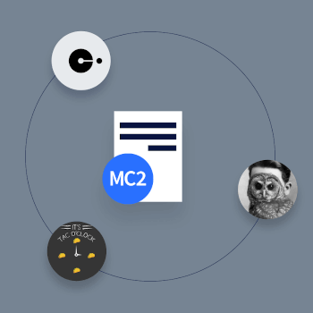

# Project History

---

{ align=right }

Decred is based on a [proposal](https://decred.org/research/mackenzie2013.pdf)
for the Memcoin2 cryptocurrency from April 2013 on the Bitcointalk forum. The
user, tacotime, proposed the new cryptocurrency and worked with _ingsoc, another
Bitcointalk user, and Jake Yocom-Piatt to implement the hybrid Proof-of-Work
(“PoW”) / Proof-of-Stake (“PoS”) consensus system from Memcoin2 as a new
project, called Decred.

The major innovation of this hybrid consensus system was that it created a PoS
governance mechanism, where users opt-in to temporarily lock their coins in
exchange for participation in a lottery. These users are called stakeholders.
Several winners of this lottery are selected each block to participate in the
consensus system by voting, which puts sovereignty over decisions about Decred
directly in the hands of its stakeholders.

In contrast, every pure PoW cryptocurrency must rely primarily on its miners for
governance decisions since they alone enforce the consensus system and provide
its security. However, Decred relies on both its stakeholders and miners for
consensus and its security. The end result is that Decred’s hybrid PoW/PoS
consensus system is both substantially fairer and more secure than pure PoW
systems.

Decred’s code was built on the [btcsuite](https://github.com/btcsuite/)
codebase, an alternative full node Bitcoin implementation in Go, written by
Company 0, LLC. Despite Decred being based on Bitcoin’s code, it is a standalone
cryptocurrency, not a “Bitcoin fork”. This work began in February 2014 and
continued with the assistance of Company 0, LLC until its mainnet launch in
February 2016.

---

## Airdrop & Premine

During the [launch](../advanced/premine.md) in February 2016, Decred used an
innovative airdrop and small premine to bootstrap the PoS component of the
Decred network, establish a wide network of potential project contributors, and
compensate the early developers for their work prior to launch. Given the
necessity of distribution, this process was determined to be fair, transparent,
and yielded significant decentralization from the outset.

---

## Decred Timeline

| Date         | Milestone |
|-------------:|-----------|
| December 15, 2015 {: .timeline-date}  | [Decred announced on bitcointalk](https://bitcointalk.org/index.php?topic=1290358.0) {: .timeline-event} |
| January 1, 2016 {: .timeline-date}    | [Airdrop vetting finalized](https://forum.decred.org/threads/airdrop-rundown.313/) {: .timeline-event} |
| February 8, 2016 {: .timeline-date}   | [Decred mainnet launched](https://explorer.dcrdata.org/block/298e5cc3d985bfe7f81dc135f360abe089edd4396b86d2de66b0cef42b21d980) {: .timeline-event} |
| February 12, 2016 {: .timeline-date}  | [Initial stake pool release](https://forum.decred.org/threads/testnet-stake-pool-is-live.626/) {: .timeline-event} |
| February 21, 2016 {: .timeline-date}  | [First PoS votes are included in block 4096](https://explorer.dcrdata.org/block/00000000000013722f8e5a8af9cf55492e9237e77d29da98695e65fd13033625) {: .timeline-event} |
| December 26, 2016 {: .timeline-date}  | [First release of Decrediton GUI wallet for Linux/OSX](https://forum.decred.org/threads/dd-20-v0-7-0-12-26-16.4702/#post-23300) {: .timeline-event} |
| June 14, 2017 {: .timeline-date}      | [Initial dcrtime release](https://blog.decred.org/2017/06/14/dcrtime-Blockchain-based-Timestamps/) {: .timeline-event} |
| July 9, 2017 {: .timeline-date}       | [First consensus vote in the history of cryptocurrency to change Decred&#39;s stake difficulty algorithm](https://blog.decred.org/2017/04/03/A-New-Ticket-Price-Algorithm/) {: .timeline-event} |
| October 19, 2017 {: .timeline-date}   | [Atomic swap tools released with Decred, Bitcoin and Litecoin support](https://blog.decred.org/2017/09/20/On-Chain-Atomic-Swaps/) {: .timeline-event} |
| October 25, 2017 {: .timeline-date}   | [Politeia is announced](https://blog.decred.org/2017/10/25/Politeia-Proposals-in-a-Timestamped-Filesystem/) {: .timeline-event} |
| June 9, 2018 {: .timeline-date}       | [DEX proposal is published](https://blog.decred.org/2018/06/05/A-New-Kind-of-DEX/) {: .timeline-event} |
| September 21, 2018 {: .timeline-date} | [Initial SPV release for dcrwallet](https://github.com/decred/decred-binaries/releases/tag/v1.3.0) {: .timeline-event} |
| October 15, 2018 {: .timeline-date}   | [Politeia goes live on mainnet](https://blog.decred.org/2018/10/15/Politeia-in-Production/) {: .timeline-event} |
| May 9, 2019 {: .timeline-date}        | [Lightning Network support activated on mainnet](https://github.com/decred/dcps/blob/master/dcp-0004/dcp-0004.mediawiki) {: .timeline-event} |
| August 28, 2019 {: .timeline-date}	| [First CoinShuffle++ mixes live on mainnet](https://blog.decred.org/2019/08/28/Iterating-Privacy/) {: .timeline-event} |
| September 25, 2019 {: .timeline-date}	| [Initial release of dcrpool mining pool software](https://blog.decred.org/2019/09/25/Introducing-Dcrpool/) {: .timeline-event} |
| December 16, 2019 {: .timeline-date}	| [Release of Decred software v1.5.0](https://github.com/decred/decred-binaries/releases/tag/v1.5.0) {: .timeline-event} |
| February 14, 2020 {: .timeline-date}	| [DCP0005 approved, enabling block header commitments which allow for more secure Simplified Payment Verification (SPV) wallets](https://github.com/decred/dcps/blob/master/dcp-0005/dcp-0005.mediawiki) {: .timeline-event} |
| January 25, 2021 {: .timeline-date}	| [Release of Decred software v1.6.0, incorporating first DCRDEX release](https://github.com/decred/decred-binaries/releases/tag/v1.6.0) {: .timeline-event} |
| April 9, 2021 {: .timeline-date}		| [DCP0006 approved, to enable the decentralized treasury](https://github.com/decred/dcps/blob/master/dcp-0006/dcp-0006.mediawiki) {: .timeline-event} |
| December 28, 2021 {: .timeline-date}	| [First payment to contractors from the decentralized treasury (tspend)](https://dcrdata.decred.org/tx/f57f2f35abcfc58cb8d45da6315982610203c1335ee0d68b36240f22c24a557a) {: .timeline-event} |
| January 24, 2022 {: .timeline-date}	| [Release of Decred software v1.7.0](https://github.com/decred/decred-binaries/releases/tag/v1.7.0) {: .timeline-event} |
| April 10, 2022 {: .timeline-date}		| [Approval of DCP0007 (fix treasury bug), DCP0008 (explicit version upgrades), DCP0009  (automatic ticket revocations) & DCP0010 (Change PoW/PoS Subsidy Split)](https://voting.decred.org/) {: .timeline-event} |
