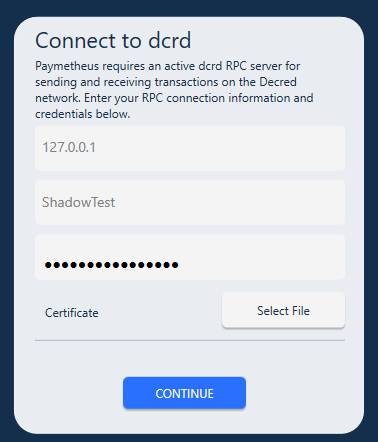
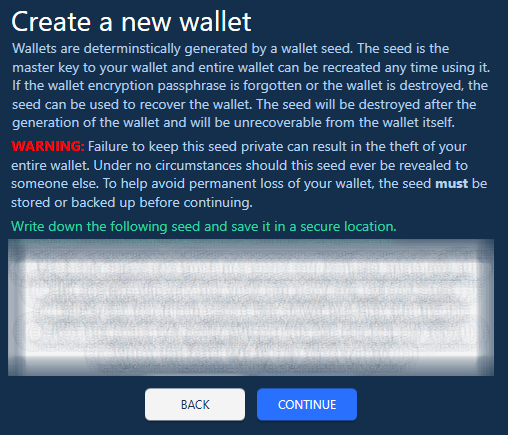

Paymetheus

Paymetheus is a simple to use graphical wallet for Decred. With it, you can send and receive DCR, 
purchase tickets for PoS <LINK> voting, get a history of all your transactions and more. About the only thing Paymetheus doesn't do is PoS voting.

Download and Install
The first thing you'll need to do is get a copy of Paymetheus. You will find the downloads here<LINK>. 
Download the file for your operating system and install. Once you're done, run the 'Paymetheus Standalone' program.

Setup dcrd
At this time, Paymetheus requires a running dcrd server to use to connect to the Decred network. If you're not sure what that means, 
don't worry, we'll take you through it. Basically you need to run another program that Paymetheus will use to connect. 
Use the following link to get a dcrd server up and running now. Once it's done you can come back here and we'll continue.

Start Paymetheus
You're now ready to start using Decred! Start Paymetheus Standalone. You will now see the connection screen:  
  
Leave the top field alone and type in the user name and password that you chose when setting up dcrd.

Create or Restore Wallet  
You will now have the option to create a new wallet or restore a wallet from a seed. If you're reading this, you're probably new and don't 
already have a wallet so let's create a new one. If you click restore, you will be asked to enter your seed words instead of being given a new list.
The rest of the process is the same. Click "Create a new wallet". You will see the following screen:  
  

STOP HERE!!! DO NOT CLICK CONTINUE!  

This is the most important part of using Decred. In the white box you key (or seed) words are displayed. These words are the key to your wallet.  

WITHOUT THESE WORDS OR THE HEX REPRESENTATION YOU WILL PERMANANTLY AND FOREVER LOSE ACCESS TO YOUR FUNDS!  

DO NOT GIVE THEM TO ANYONE ELSE, NOT EVEN DECRED DEVELOPERS! With these words, someone else can recreate your wallet on another computer and transfer
all of funds out to another wallet. It is not possible to reverse a transaction in Decred, so if someone steals your Decred, there is no way to get it back.  

Decred and other digital currencies are often described as being like a bank account. This is true, but your wallet is like an actual, physical wallet.
If you lose your wallet, you lose access to whatever you had in it and no one, not even the Decred developers can get it back. So it's very important
that you take the time to read this page and WRITE DOWN the key words in a safe place. A good idea is to write them on a piece of paper and store them
somewhere secure and also store them in an ENCRYPTED file on your computer. Cloud storage like Dropbox or OneDrive is fine, but remember that other people
can access them which is why you should encrypt the file (MS Word or Libre/OpenOffice can do this).  

Okay, so you've secured your key words in at least two different places. Click Continue. You are now asked to type them back in to ensure you have written 
them down correctly in case you need to restore your wallet later. Note you can't paste them; you will need to type them. Do so and click Confirm. 
This is tedious, but it's to make sure you have the words correct.  

Choose a Private Wallet Passphrase  
Enter a passphrase to use whenever you send coins or sign transactions. There is also the option here for a public passphrase which can protect your wallet 
in case it's compromised. If you secure your wallet key words and don't give them to anyone this step is usually overkill, so you can leave it unticked.
Once you've entered your new passphrase, click Encrypt.  

Your wallet will now create and synchronize to the blockchain. This can take a few minutes on slower computers. Note that the key words you wrote down will 
work with any Decred wallet application, not just Paymetheus.

