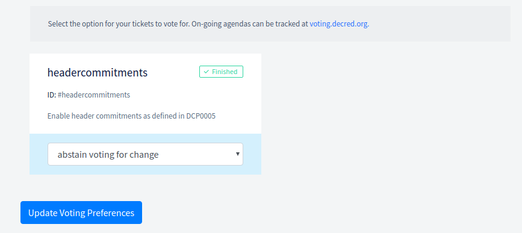
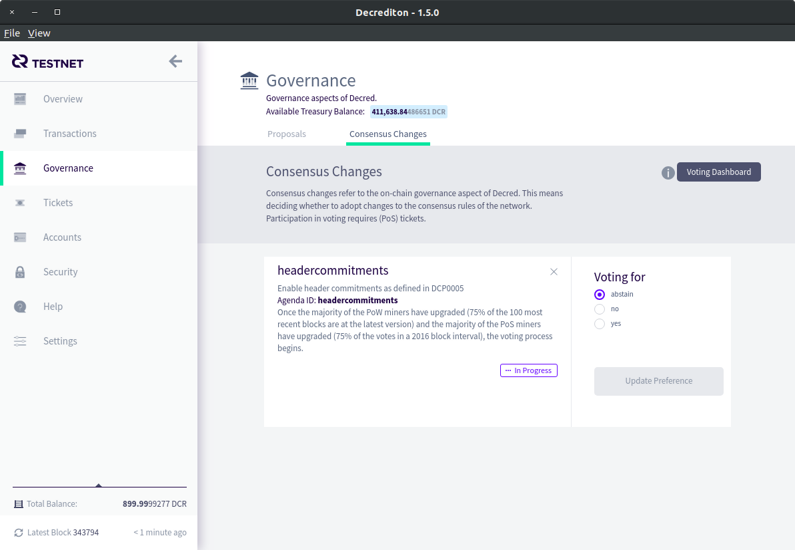

# { .dcr-icon } How to Vote

---

This guide assumes you already have an active wallet and have purchased tickets. If not, please follow the [Voting Preparation](overview.md#voting-preparation) guide.

The choice a ticket votes with depends on your vote preference at the time the ticket is chosen, not when it is bought. So you can set your choice at any time within the voting window and all future tickets will vote accordingly.

## { .dcr-icon } Voting with a Voting Service Provider (VSP)

If your Voting Service Provider (VSP) has updated to the latest VSP software, you will find a 'Voting' page in the navigation menu with dropdown options for each agenda. After you've chosen how you want your tickets to vote, simply press the 'Update Voting Preferences' button to save your vote choices.



You can also update your voting preferences via Decrediton.
Under the 'Governance' section, 'Consensus Changes' tab, you'll find the option
to set your vote.



---

## { .dcr-icon } Solo Voting

Through the command line, you'll want to familiarize yourself with the following commands:

```no-highlight
dcrctl --wallet getvotechoices
```

```no-highlight
dcrctl --wallet setvotechoice "agendaid" "choiceid"
```

The `getvotechoices` command returns a JSON payload describing the agendas which
are currently up for vote.
The `choiceid` field indicates your selected voting preference, and is set to
`abstain` by default.

The `setvotechoice` let's you set your voting preference.
You can get the `agendaid` for votes using the above `getvotechoices` command.
The `choiceid` field can be set to `yes`, `no`, or `abstain`.
