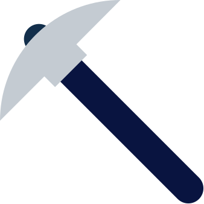
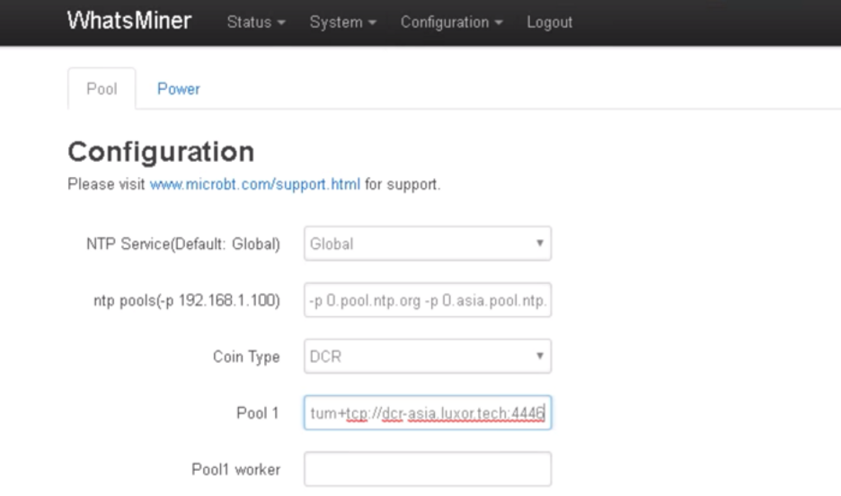
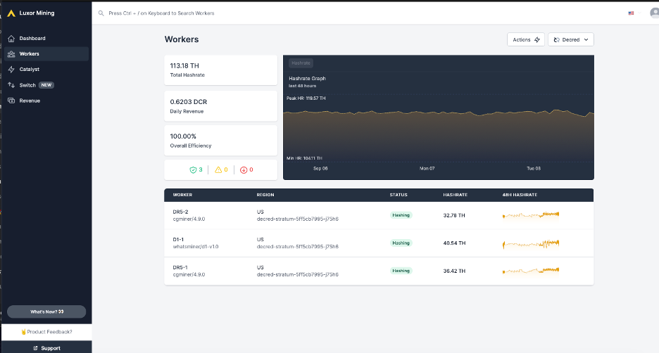

# { .dcr-icon } Proof-of-Work (PoW) Mining

---

Proof-of-work mining, more commonly referred to as PoW mining, is the activity
of committing your computer’s hardware and resources to process network
transactions and build the blocks that make up the Decred blockchain.

Each time a valid block is created by a miner, the miner receives the fees from
all of the transactions included in the block, as well as a block reward (newly
created DCR).

The block reward reduces by a factor of 100/101 every 6,144 blocks
(approximately 21.33 days).
For more details on the block reward and growth of the coin supply, see the
[Issuance](../advanced/issuance.md) page.

When proof-of-stake tickets are called to vote on a block, they have the ability
to the strip the reward from the miner of the previous block.
This power may be used if the miner has constructed a block contrary to the best
interests of the network. For example, an empty block when there are
transactions waiting to be processed in the mempool.

Decred uses the [BLAKE-256](../research/blake-256-hash-function.md) hashing function. PoW mining can be done using GPUs. However, ASICs that mine DCR are now available, and since their introduction the PoW difficulty has become high enough to make GPU
mining unlikely to be profitable.

---

## Purchasing Specialized Hardware (ASIC)

ASIC are the machines used to mine the most popular cryptocurrencies and can only be used for mining a single algorithm. 

Here is a selection of the Decred ASIC miners which are available on the market today:

| Miner             | Hashrate    |Power Consumption (Watts)| Unit Power (W/Th)| 
| ------------------|:-----------:|:-----------------------:|:----------------:|
| StrongU STU-U1++  | 52 TH/s     | 2,100 W                 |40 W/Th           |
| Whatsminer D1     | 48 TH/s     | 2,200 W                 |46 W/Th           |
| Antminer DR5      | 35 TH/s     | 1,610 W                 |46 W/Th           |

You can either buy direct from the manufacturers on their official website:

*   [Whatsminer](https://www.whatsminer.com/?locale=en)
*   [Bitmain](https://www.bitmain.com/)
*   [StrongU](https://strongu.com.cn/?lang=en-us)

Or you can also go through ASIC resellers such as:

*   [Blockware Mining](https://www.blockwaresolutions.com/)
*   [Kaboom Racks](http://kaboomracks.com)

---

## Hosting Your ASIC

When mining first started on CPU and GPU’s mining at home was very feasible. But as mining has become more competitive and industrialized, ASICs have taken over the network. For most people hosting an ASIC at home is not an option given the noise & power draw. That is why many miners choose to send their ASICs to a mining colocation. The hosting company charges a “hosting fee” in return for providing the ASIC electricity and an environment to run. Different models such as profit-sharing are available for larger miners. 

Over the past few years many hosting companies have become available in North America and can be found in this [database](https://hashrateindex.com/farms). This database contains some of the top facilities like Blockware, Compute North, Core Scientific, Frontier, Box Miner, and many more. 

Please make sure to do your own research before making any decision on engaging a colocation business.

---

## Setting up your ASIC

**Powering up the Miner**

Connect your machine to the power outlet via the built-in PSU. Then connect your miner to your internet-connected router or switch using a standard network cable. You are now ready to power up your miner.

**Scanning for Devices**

To get started, use a scanning tool like [AngryIP](https://angryip.org/) or [Locator](https://minerstat.com/software/locator) to scan every device on your local network and see its IP address. After you have identified your miner’s IP address, you are ready to proceed with Configuration.

**Configuration**

Enter the local network IP address of your miner in the URL bar of any web browser. A dashboard similar to the one shown below will pop up. We are setting up a Whatsminer D1, but the process is similar for other ASICs.

---

## Solo Mining or Pool Mining

##### { .dcr-icon } Solo Mining

:fontawesome-solid-exclamation-triangle: **Solo mining is not recommended and is not covered by this documentation!** The Decred network regularly sees a network hash rate of up to 422Ph/s. Solo mining is generally only done by advanced individuals or organized groups with a large cluster of GPUs so it is not addressed here.

#### Pool Mining

When you mine in a pool, your hashrate is combined with all the other pool miners’ hashrates to look for the correct solution for a block. You will receive a reward based on the amount of work your miner performs in the pool. Most mining pools pay on a pay-per-share method meaning that miners earn a steady amount of Decred rather than the “all or none” of solo mining.

--- 

## Choosing and Configuring a Mining Pool

To finish the configuration, you will need to choose a mining pool. You can consider payout method ([PPS vs PPLNS](https://www.hashrateindex.com/blog/pps-fpps-pplns-pps_plus)), pool fee, geographic location of the pool, ping time to the server, user interface, statistics/data, customer support, community channels and more. Mining pools all work more or less the same but you may wish to sign up at multiple pools and see which one suits you the best.

You may wish to consider selecting a smaller pool to distribute the hashrate more widely and better decentralize the networks mining power.

These mining pools are known to support Decred:

*   **[Luxor](https://mining.luxor.tech/coins/decred)** (USA)
*   **[F2Pool](https://www.f2pool.com/)** (China)
*   **[Poolin](https://www.poolin.com/)** (China)
*   **[UUpool](https://uupool.cn/dcr)** (China)
*   **[Antpool](https://antpool.com/)** (China)
*   **[BTC.com](https://pool.btc.com/)** (China)
*   **[CoinMine](https://www2.coinmine.pl/)** (Poland)

In this guide, we will set up an ASIC with [Luxor](https://mining.luxor.tech/), a US-based mining pool that operates based on the pay-per-share (PPS) payment method. 

**Completing Configuration**

Once you have created a [user account](https://mining.luxor.tech/account/signup) with the mining pool, you will have all the information you need to complete the setup process.

*   URL: `stratum+tcp://dcr.luxor.tech:700`
*   Worker: `[LuxorUsername].WorkerName` Workername can be anything, but avoid using symbols or special characters as it may be invalid.
*   Password: `123`

Once you have filled out the details, click Save & Apply. Setup is now complete.

**Monitoring Results**

It will take about 5 minutes for your workers to appear on the stats page. To find your user, simply go to Luxor, login to your account and navigate to the Workers tab. You should see something like this:

