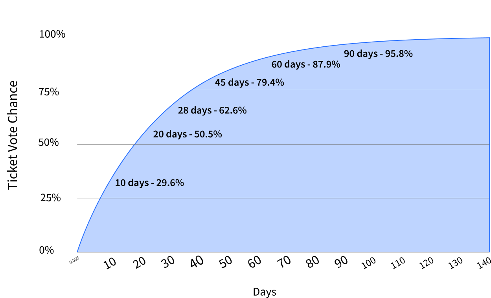

# { .dcr-icon } Proof-of-Stake (PoS) Voting

---

## Overview

Proof-of-Stake (PoS) voting is a form of Proof-of-Stake (PoS) security, but the way Decred integrates this as a complement to Proof-of-Work (PoW) mining gives it a distinctive set of roles and characteristics.

PoS voting serves a number of purposes:

1. Allowing stakeholders to vote for or against proposed changes to the Decred blockchain. If stakeholders vote in support of a change, the chain will hard fork and the new feature becomes active automatically. More information on voting can be found in the [Mainnet Voting Guide](../governance/consensus-rule-voting/overview.md).
1. Providing a mechanism for stakeholders to influence Proof-of-Work (PoW) miners. Stakeholders can vote to withhold a miner's reward even if the block conforms to the consensus rules of the network. This allows stakeholders, in principle, to discourage problematic mining behavior such as mining empty blocks.
1. For a block to be valid, it has to be signed by at least 3 of the 5 tickets that are called to vote in that block. This makes the Decred blockchain more robust to certain kinds of attack, such as those which rely on secret mining.
1. The same principle makes the Decred blockchain resistant to contentious hard forks. PoW Miners are unable to build on a chain without the Votes of the tickets that are called.
1. Snap voting of live tickets is used to make decisions about the project treasury through [Politeia](../governance/politeia/overview.md).

These roles are incentivized; ticket-holders (or "Proof-of-Stake (PoS) Voters") collectively receive 30% of the block reward when their tickets are called to vote.

---

## How Ticket Voting Works

To participate in PoS voting, stakeholders lock some DCR in return for a ticket. An individual stakeholder can purchase one or more tickets. The amount of DCR locked, or **Ticket Price**, is adjusted dynamically every 144 blocks (~12 hrs). The current ticket price can be found in [Decrediton](../wallets/decrediton/decrediton-setup.md) or on [dcrdata.decred.org](https://dcrdata.decred.org/). Partial tickets can also be purchased using [ticket splitting](ticket-splitting.md) software. Every ticket owned gives its holder the ability to cast a single vote. Upon voting, each ticket returns a small reward plus the original **Ticket Price** of the ticket. 

Tickets are selected pseudorandomly according to a Poisson distribution. The average time it takes for a ticket to vote is 28 days, but possibly requiring up to 142 days, with a 0.5% chance of expiring before being chosen to vote (this expiration returns the original **Ticket Price** without a reward). Every block mined must include a minimum of 3 votes (miners are penalized by a reward deduction if fewer than 5 votes are included).

Below is a chart showing the probability of a ticket voting by day.

Every block mined can also include up to 20 fresh ticket purchases. A new ticket requires 256 blocks to mature before it is entered into the **Ticket Pool** and can be called to vote.

There are a few important variables that you should familiarize yourself with while staking.

Every 144 blocks (~12 hours), the stake difficulty algorithm calculates a new **Ticket Price** in an attempt to keep the **Ticket Pool** size near the target pool size of 40,960 tickets. This 144 block window is referred to as the `StakeDiffWindowSize`.

The **Ticket Price**/**Stake Difficulty** is the price you must pay for a ticket during a single 144 block window.

The **Ticket Pool** is the total number of tickets in the Decred network.

The **Ticket Fee** (`ticketfee`) is the fee that must be included in the ticket purchase to incentivize Proof-of-Work (PoW) miners to include that ticket in a new block. **Ticket Fee** usually refers to the DCR/kB fee rate for a ticket purchase transaction. The **Ticket Fee** defaults to the minimum (0.0001 DCR/kB), which is typically sufficient. 

**When a ticket is called to vote, the wallet that has voting rights for that ticket must be online.** If the wallet is not online to cast its vote, the ticket will be marked as `missed` and you will not receive a reward for that ticket. In practice, **Solo Voters** often run voting wallets on a number of servers on different continents, to minimize the chance of their tickets missing a call to vote.

**Voting Service Providers (VSPs)** offer a service whereby ticket buyers can delegate the act of voting to the VSP. The ticket-buyer instructs the VSP how their ticket should vote on any open rule change proposals, and shares voting rights with the VSP to take advantage of the voting infrastructure they provide (i.e. at least three always-online servers).

VSPs charge a fee for this service, which is paid upfront before the ticket is added to the VSPs voting wallets. This fee is generally 5% or less. A [list of VSPs](https://decred.org/vsp/) is maintained on decred.org. VSPs do not take custody of DCR. By using them, you only delegate the voting rights of a ticket.

---

## Ticket Lifecycle

Purchasing a ticket is quite simple (see below), but what happens to it after you buy it?
A ticket on mainnet (testnet uses different parameters) will go through a few stages in its lifetime:

1. You buy a ticket using a Decrediton or dcrwallet wallet. The total cost of each single ticket transaction should be **Ticket Price** + **Ticket Fee**(`ticketfee`).

1. Your ticket enters the `mempool`. This is where your ticket waits to be mined by PoW miners. Only 20 fresh tickets are mined into each block.

1. Tickets are mined into a block, with higher **Ticket Fee** transactions having a higher priority. Note that the **Ticket Fee** is DCR per KB of the transaction. A few common transaction sizes are 298 Bytes (a solo ticket purchase) and 539 Bytes (a pool ticket purchase).

1. **A -** If your ticket is mined into a block, it becomes an immature ticket. This state lasts for 256 blocks (about 20 hours). During this time the ticket cannot vote. At this point, the ticket fee is non-refundable.

    **B -** If your ticket is not mined, both the **Ticket Price** and **Ticket Fee** are returned to the purchasing account.

1. After your ticket matures (256 blocks), it enters the **Ticket Pool** and is eligible for voting.

1. The chance of a ticket voting is based on a Poisson distribution with a mean of 28 days.

1. Given a target pool size of 40,960 tickets, any given ticket has a 99.5% chance of voting within 40,960 blocks (approximately 142 days, or 4.7 months). If, after this time, a ticket has not voted, it expires. You receive a refund on the original **Ticket Price**.

1. A ticket may miss its call to vote if the voting wallet does not respond or two valid blocks are found within close proximity of each other. If this happens, you receive a refund on the original **Ticket Price**.

1. After a ticket has voted, missed, or expired, the funds (ticket price and reward if applicable, minus the fee) will enter immature status for another 256 blocks, after which they are released. If a ticket is missed or expired, a ticket revocation transaction is submitted by the wallet which then frees up the locked ticket outputs. **NOTE:** Revocations can only be submitted for a corresponding missed ticket. You cannot revoke a ticket until it is missed.

---

## Additional Information

[Mainnet Voting Guide](../governance/consensus-rule-voting/overview.md)

[Proof-of-Stake FAQ - General](../faq/proof-of-stake/general.md)

[Proof-of-Stake FAQ - Buying Tickets and Fees](../faq/proof-of-stake/buying-tickets-and-fees.md)

[Proof-of-Stake FAQ - Solo Mining](../faq/proof-of-stake/solo-voting.md)

[Proof-of-Stake FAQ - Voting Service Providers](../faq/proof-of-stake/voting-service-providers.md)
