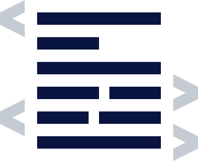

# { .dcr-icon } BLAKE-256 Hash Function

---

BLAKE-256 is the hashing algorithm used in Decred. It is an extremely flexible function for hardware and is very fast in software, both of which are desirable properties for a block hashing algorithm. BLAKE is a versatile and user-oriented design that performs well on all platforms, from embedded systems to resource-constrained hardware and requires low resources for implementation [^1] [^2] [^3].

It is worth noting that BLAKE is a finalist of [The National Institute of Standards and Technology (NIST) SHA-3 competition](https://csrc.nist.gov/projects/hash-functions/sha-3-project), a public competition for alternatives to SHA-1 and SHA-2 with better efficiency and resilience to future attacks. During the competition, BLAKE was thoroughly analyzed and attacked to identify vulnerabilities by notable cryptanalysts [^1]. Below sections contain information regarding BLAKE-256 components, security and performance in hardware and software.

| Algorithm     | Word  | Message   | Block     | Digest    | Salt  | Rounds
|-----------    |:----: |:-------:  |-------    |--------   |------ |-------|
| BLAKE-256     |  32-bit   |  64-bit   |  512-bit      |   256-bit     | 128-bit   | 14    |

**<em>Table 1: Characteristics of the BLAKE-256 hash function </em>**

### BLAKE Components

BLAKE is built on previously analyzed, and reliable components; the hash iterative framework (HAIFA) of Biham and Dunkelman [^4], the local wide-pipe introduced by the LAKE hash function[^6], and the core function inspired by ChaCha function of Bernstein [^5]. The use of well understood building blocks makes BLAKE a hash function that is simple to analyze and implement for cryptanalysts and implementers alike.

#### HAIFA iteration mode

The construction of a hash output is typically done by splitting the input data referred to as a 'message', into small blocks of fixed length and processed iteratively using a cryptographic compression function. The combination of calls to a compression function for processing the input data is an iteration mode (also referred to as a Domain Extender). The Merkle–Damgård (M-D) construction is the classic iteration mode used by MD5, SHA1, RIPEMD-160, and SHA2 hash functions. M-D splits the variable length input message into equal-sized message blocks _x_{: .dcrm } (i.e., 512 bits) of _n_{: .dcrm } blocks, the last block is padded as required and appended with the length of the message.

**<em>Figure 1: Merkle–Damgård Construction</em>**

As shown in Figure 1 above, the output of the compression function _f_{: .dcrm } known as a chaining value _CV_{: .dcrm } and the initial inputs are the Initialization Vector _IV_{: .dcrm } shown as _CV~0~_{: .dcrm }, with _h(x)_{: .dcrm } being the output after all message blocks are processed. M-D maintains the collision resistance of the compression function however it lacks the pre-image and second pre-image resistance. As a result generic attacks such as the multicollision, the long message second-preimage, herding and length extension are possible on M-D based hash functions [^7] [^8] [^9] [^10] [^11].

BLAKE uses HAIFA, which maintains the valuable properties of the M-D construction and adds to the security and scalability of the transformation. HAIFA is essentially an M-D construction but with a mandatory counter (number of bits hashed so far) and an optional salt (random data that used as an additional input).

**<em>Figure 2: HAIFA Construction</em>**

This iteration mode solves many of the internal collision problems with the M-D construction and provides resistance to herding, long message second pre-image, and length extension attacks as the additional salt and counter simulate distinct compression functions for each data block processed [^4] [^12]. HAIFA is both prefix-free and suffix-free and, as a result, is collision-resistant as well as indifferentiable from a random oracle, assuming the underlying compression function is ideal [^1] [^13] [^14].

#### The local wide-pipe and ChaCha inspired core function

**<em>Figure 3: Local wide-pipe construction of BLAKE's compression function, inherited from LAKE hash function [^6]</em>**

BLAKE uses the LAKE local wide-pipe structure for its strong security guarantees against collision attacks [^1] [^6] and a core function _G_{: .dcrm } inspired by the stream cipher ChaCha for its simplicity and security [^1]. The compression function takes as input four values: a chaining value, a message block, an optional salt and a mandatory counter. In the case of BLAKE-256:

|Chaining Value|Message Block|Salt|Counter
|-------|-------|-------|------|
|256-bit|512-bit|128-bit|64-bit|

The structure then works in three steps:

1. Initialization of a large internal state represented by 16 words in a 4x4 word matrix.

1. 14 rounds of the _G_{: .dcrm } function with each round consisting of eight round-dependent transformations.

1. Finalization after a series of rounds, a new sequence of values taken from the matrix using sequence of initial values and salt.

A more detailed description can be found in the [SHA-3 proposal BLAKE](https://decred.org/research/aumasson2010.pdf).

### Security Evaluation Criteria

The security of a cryptographic hash function is determined by the number of queries or guesses required to solve the following problems:

1. Pre-image resistance (one-way): Given the _y_{: .dcrm } as an output of the hash function, it is computationally infeasible to find message _x_{: .dcrm } such that _h(x) = y_{: .dcrm }. [^4]

    

    **<em>Figure 6: Pre-image resistance </em>**

1. Second pre-image resistance (weak collision resistant): Given _x_{: .dcrm }, it is computationally infeasible to find a second pre-image  _x' ≠ x_{: .dcrm } such that _h(x) = h(x')_{: .dcrm } [^4]

    

    **<em>Figure 7: Second pre-image resistance </em>**

1. Collision resistance (strong collision-resistant): It is computationally infeasible to find any two distinct inputs _x, x'_{: .dcrm } that hash to the same output such that _h(x) = h(x')_{: .dcrm } [^4]

    

    **<em>Figure 8: Collision resistance </em>**

1. Length-extension resistance: Based on the hash of an unknown message _h(x)_{: .dcrm } and the length of the message _len(x)_{: .dcrm } it is not possible to choose a message _x'_{: .dcrm } to calculate _h(x')_{: .dcrm } such that _h(x') = h(x)_{: .dcrm }.

    

    **<em>Figure 9: Length extension attack: Since _x_{: .dcrm } and _x'_{: .dcrm } share the same first _n_{: .dcrm } blocks, the hash value _h(x)_{: .dcrm } is the intermediate hash value after first _n_{: .dcrm } blocks when computing _h(x')_{: .dcrm }</em> [^17]**

In the first three properties, the phrase _computationally infeasible_ means it would take the fastest computer a long time to solve the problem, e.g., billions of years, making it impossible in practice. Also, the fourth property, resistance to Length-extension attacks, is an additional requirement outlined in NIST's evaluation criteria for its SHA-3 candidates hash function [^15].

BLAKE was subject to a great deal of depth during cryptanalysis, more so than other candidates likely due to its similarity with ARX (modular addition, rotation, and XOR) based hash functions, which meant that many existing techniques and tools existed for beginning the analysis [^16].

> “Keccak received a significant amount of cryptanalysis, although not quite the depth of analysis applied to BLAKE.”

> “BLAKE and Keccak have very large security margins.”

> "Skein and BLAKE have no known distinguishing attacks that come close to threatening their full-round versions."

**<em>NIST in Third-Round Report of the SHA-3 Cryptographic Hash Algorithm Competition</em>**[^16]

#### BLAKE-256 Security bounds

|Attack|NIST's Security Requirements|BLAKE-256 Proven Generic Security
|------------|----------------|-----|
|Preimage|256-bit|256-bit|
|Second-Preimage|256-bit|256-bit|
|Collision|128-bit|128-bit|
|Length-extension|Should be resistant|Immune
|Indifferentiablity|Not specified|128-bit

**<em>Table 3: Minimum Security Requirements for a Hash Function and proven security of BLAKE-256 in Bits</em >** [^15] [^16]

Analysis of BLAKE's Domain extender proved that BLAKE-256 is secure against preimage, second-preimage, and collision attack up to 2^256^, 2^256^, and 2^128^ queries, respectively and is indifferentiable from a random oracle up to 2^128^ queries. Additionally, the counter in BLAKE protects against length extension attacks, as it assures consecutive compressions are different.

### Software Performance

A significant amount of data on the performance of BLAKE and other SHA-3 finalists is available on the [eBASH](http://bench.cr.yp.to/ebash.html) site with the best comparative presentation of data being the ["shootout" graphs](http://bench.cr.yp.to/results-sha3.html). The shootout graphs include data from AMD64 processor models, X86 processor implementations, ARM-NEON and 32-bit RISC (Reduced Instruction Set Computers). The throughput is stated in machine cycles-per-byte, where fewer cycles indicate better performance. BLAKE-256 is notable for its high performance on x86-64 microarchitecture, being faster for short messages than SHA-256 [^18] despite being considered to have a much higher security margin at 14-rounds.

> “Skein and BLAKE have the best overall software performance.”

> "On 32-bit machines (mainly ARM processors) without vector units, BLAKE-256 is the overall leader, although it has only a small throughput advantage over SHA-256"

> "On small embedded computers, BLAKE-256 has the best overall performance. BLAKE-256’s throughput is usually at or near the top, although occasionally slightly less than SHA-256, while BLAKE-256 generally has smaller memory requirements than SHA-2 and most of the other candidates."

**<em>NIST in Third-Round Report of the SHA-3 Cryptographic Hash Algorithm Competition</em>**[^16]

In the context of Decred, BLAKE-256 has excellent support for parallelism in both multi-core and single-core instruction-level scenarios (e.g. AVX2). This is important because the vast majority of validation takes place in general purpose hardware while mining takes place in specialized hardware.

### Hardware Performance

Data on the performance of hardware implementations of Field Programmable Gate Arrays (FPGA) and Application Specific Integrated Circuits (ASIC), for BLAKE-256 and other SHA-3 finalists is available on the [GMU CERG Database](http://cryptography.gmu.edu/athenadb/asic_hash/rankings_view) similar to the eBASH site. BLAKE was found to provide the best performance of any algorithm for very compact FPGA imlementations, which should also be true for ASIC implementations [^16]. High-performance implementations of BLAKE-256 in FPGAs or ASICs provide the same throughput as SHA-256 but require around twice the size, so BLAKE-256 throughput/area ratio is roughly half that of SHA-2. However, BLAKE has a significant advantage in hardware due to its high flexibility for hardware implementations [^2].

>"Reasonably efficient, folded or serial implementations of all of the algorithms seem achievable, but BLAKE and Grøstl seem the most flexible."

**<em>NIST in Third-Round Report of the SHA-3 Cryptographic Hash Algorithm Competition</em>**[^16]

In Decred, only a single round of BLAKE-256 hashing occurs versus two rounds of SHA-256 in Bitcoin due to its technical shortcomings. The combined effect is that it takes much less energy to find a solution for a given hash rate.

---

## { .dcr-icon } References

[^1]: Aumasson J., Henzen L., Meier W., Phan R. 2010. [SHA-3 proposal BLAKE](https://decred.org/research/aumasson2010.pdf)

[^2]: Aumasson J., Henzen L., Meier W., Phan R. 2014. [The hash function BLAKE](https://www.springer.com/gp/book/9783662447567)

[^3]: Balasch, J., Ege, B., Eisenbarth, T., Gérard, B., Gong, Z., Güneysu, T., Heyse, S., Kerckhof, S., Koeune, F., Plos, T., Pöppelmann, T., Regazzoni, F., Standaert, F.-X., Van Assche, G., Van Keer, R., van Oldeneel tot Oldenzeel, L., von Maurich, I.: [Compact implementation and performance evaluation of hash functions in ATtiny devices](https://eprint.iacr.org/2012/507.pdf)

[^4]: Eli Biham, Orr Dunkelman. [A Framework for Iterative Hash Functions — HAIFA](https://eprint.iacr.org/2007/278.pdf)

[^5]: Bernstein, D.J.: [ChaCha, a variant of Salsa20](http://cr.yp.to/chacha.html)

[^6]: Aumasson, J.P., Meier, W., Phan, R.C.W.: [The hash function family LAKE](https://link.springer.com/chapter/10.1007/978-3-540-71039-4_3)

[^7]: Thai Duong, Juliano Rizzo: [Flickr's API Signature Forgery Vulnerability](http://netifera.com/research/flickr_api_signature_forgery.pdf)

[^8]: Antoine Joux. [Multi-collisions in iterated hash functions](https://www.iacr.org/archive/crypto2004/31520306/multicollisions.pdf)

[^9]: Richard Drews Dean. [Formal Aspects of Mobile Code Security](https://sip.cs.princeton.edu/pub/ddean-thesis.pdf)

[^10]: John Kelsey and Bruce Schneier. [Second preimages on n-bit hash functions for much less than n 2 work](https://eprint.iacr.org/2004/304.pdf)

[^11]: John Kelsey and Tadayoshi Kohno. [Herding hash functions and the Nostradamus attack](https://csrc.nist.gov/CSRC/media/Events/First-Cryptographic-Hash-Workshop/documents/Kelsey_HerdingHash.pdf)

[^12]: Aumasson J., Henzen L., Meier W., Phan R. 2014. [The hash function BLAKE](https://www.springer.com/gp/book/9783662447567) Page 118.

[^13]: Aumasson J., Henzen L., Meier W., Phan R. 2014. [The hash function BLAKE](https://www.springer.com/gp/book/9783662447567) Page 149-150.

[^14]: Andreeva, Elena; Mennink, Bart; Preneel, Bart, [Security Reductions of the Second Round SHA-3 Candidates](http://eprint.iacr.org/2010/381)

[^15]: [National Institute for Standards and Technology. Announcing Request for Candidate Algorithm Nominations for a New Cryptographic Hash Algorithm (SHA3) Family](http://csrc.nist.gov/groups/ST/hash/documents/FR_Notice_Nov07.pdf)

[^16]: [Third-Round Report of the SHA-3 Cryptographic Hash Algorithm Competition](https://nvlpubs.nist.gov/nistpubs/ir/2012/NIST.IR.7896.pdf)

[^17]: Denton, Ben & Adhami, R. (2012). [Modern Hash Function Construction](https://pdfs.semanticscholar.org/3876/98fade12e28c4c04e1cd0047990e7a0209c0.pdf)

[^18]: Bernstein D. and Lange T. 2013. [eBACS: ECRYPT benchmarking of cryptographic systems](https://bench.cr.yp.to)
