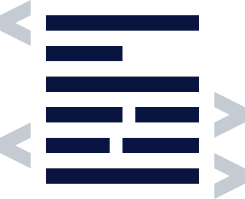

# { .dcr-icon } Schnorr Signatures

---

Schnorr signatures have been proposed for Bitcoin.
They have also been used extensively in other cryptocurrencies, such as Nxt and CryptoNote coins.
In the simplest case, a Schnorr signature ECDSA cryptosystem can be described as follows:

1. _y = xG_{: .dcrm } where _y_{: .dcrm} is the public key point on the curve, _x_{: .dcrm} is the private scalar, _G_{: .dcrm} is the curve generator.
2. _r = kG_{: .dcrm } where _r_{: .dcrm} is the point on the curve resulting from the multiplication of _k_{: .dcrm}, the nonce scalar, by the generator.
3. _h = H(M||r)_{: .dcrm } where _H_{: .dcrm} is a secure hash function, _M_{: .dcrm} is the message (usually a 32 byte hash), and _r_{: .dcrm} is the encoded point previously described. _||_{: .dcrm } denotes concatenation.
4. _s = k - hx_{: .dcrm } where _s_{: .dcrm} is the scalar denoted from _k - hx_{: .dcrm }.
5. The signature is _(r,s)_{: .dcrm }, and verification is simply _H(M||r) == hQ + sG_{: .dcrm }.

In the above, multiplications by a capital letter (e.g., _kG_{: .dcrm}) are point multiplications by a scalar, and so always result in a point on the curve.
Addition of these points results in another point.
Additions and multiplications of scalars amongst themselves is the same as regular multiplication you would do with any integer.
It's important to note that multiplying a point by a scalar is considered an irreversible step, because the calculation of the scalar from the new point defaults to the discrete logarithm problem.

From the above it is clear that _r_{: .dcrm} is a point on the curve, while _s_{: .dcrm} is a scalar.
Consider the group of signers represented by _x~sum~ = x~1~ + ... + x~n~_{: .dcrm} with nonces _k~sum~ = k~1~ + ... + k~n~_{: .dcrm}.
The public key for the private scalar sum would be: _y = x~sum~ G_{: .dcrm }.
The signature for these sums (from all group participants) would be: _r' = k~sum~ G s' = k~sum~ - h x~sum~_{: .dcrm }.
To generate this signature all participants would have to share their private key and nonces beforehand.
We want to obviously avoid this, so instead let us have each participant create a partial signature.
_r~n~ = k~1~ G + ... + k~n~ G = r'_{: .dcrm } (the sum of the public nonce points, which the participants may freely individually publish) _s~n~ = k~n~ - h x~n~_{: .dcrm }.
Substituting this into the general formulas for signatures and using point or scalar addition: _r = r~n~ = r'_{: .dcrm } (the same as above) _s = s~1~ + ... + s~n~ = s'_{: .dcrm } (simple scalar addition; it must be true that _(k~1~ - h x~1~) + ... + (k~n~ - h x~n~) = s~1~ + ... + s~n~ = s')_{: .dcrm }.
Doing an m-of-n signature is non-trivial.
It has been suggested that a Merkle tree containing all possible public key sums for _m_{: .dcrm} participants be used for these cases, generating a _log(n)_{: .dcrm } sized signature [28].

---

## { .dcr-icon } References

[^1]: Wuille P. 2015. [Tree signatures: Multisig on steroids using tree signatures](https://decred.org/research/wuille2015.pdf).
