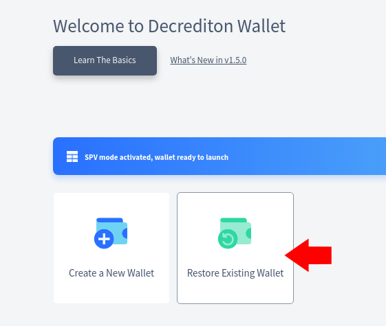

# { .dcr-icon } Using a Trezor device with Decrediton

Last updated for Decrediton v{{ decreditonversion }}.

---

!!! info "Lack of Staking Support"

    Trezor wallets used within Decrediton do **not** currently support staking operations (purchasing, voting and revoking tickets). To track progress in regards to staking with Trezor devices, please see [issue #1491](https://github.com/decred/decrediton/issues/1491) and provide feedback on the current implementation of Trezor support in Decrediton so we can gauge interest for adding this feature.
    
    
---

## Setting up the Trezor Device

Before creating a Trezor-backed wallet, first make sure your Trezor device works correctly, can be recognized by the computer and has the latest firmware. This can be done from the regular [Trezor.io Web Wallet](https://trezor.io/start/) or directly from within Decrediton by accessing the "Restore Wallet" → "Setup Device" screen.

### Handling the Seed

!!! danger "Critical Information"

    Make sure to keep your seed words secure before sending any funds to the wallet. See our [FAQ about seeds](../../faq/wallets-and-seeds.md).
    
    
When creating your Trezor-backed Decrediton wallet, you may use an already setup Trezor device (that is, a device already initialized with a seed) or wipe and input a new seed into the device.

Note that a Trezor-backed wallet can be used with multiple cryptocurrencies without conflict: different cryptocurrencies generate different addresses so they don't have a chance of "overlapping". In other words, if you already use your device with other coins, you can keep using it and use the same seed for your Decrediton wallet.

!!! info "Trezor & dcrwallet Seed Compatibility"

    Trezor seeds are **not** naturally compatible with Decrediton/dcrwallet seeds. Trezor uses [BIP0039](https://github.com/bitcoin/bips/blob/master/bip-0039.mediawiki) while standard Decred software uses a custom protocol for seed encoding.
    
    This means that you cannot directly import an existing Trezor seed in a _software_ wallet (or conversely: import an existing 33-word Decred seed to the hardware device). This is only relevant for disaster recovery scenarios though: you can still use the Trezor device to receive and send transactions normally from within Decrediton.

!!! info "Trezor Seed Length"

    Note that Decrediton only supports restoring the seed for Trezor devices if that seed is 24 words long. Smaller seeds can be restored by the standard Trezor Web Wallet.
    

### Passphrase Protected Trezor Wallets

!!! danger "Trezor Passphrases are Brain Wallets"

    Note that passphrases for Trezor wallets are **different** than regular Decrediton/dcrwallet passphrases and amount to a brain wallet. In other words, losing your passphrase means **losing access to all funds**.
    
    Please read and understand how [passphrases work in Trezor](https://wiki.trezor.io/Passphrase) **before** attempting to use passphrase-protected wallets.
    
Note that due to how passphrase-protected Trezor wallets work, each passphrase corresponds to an entirely new wallet. Therefore it's impossible to enable passphrase protection after creating the wallet: you'll need to create an _new_ wallet, with different keys and transfer the funds to this new wallet.

## Creating the Wallet

After setting up the Trezor device with a seed (and optionally enabling passphrase protection for the device) you may proceed to creating the Decrediton wallet backed by that Trezor device.

To do so, connect your Trezor device to the computer, access the "Restore Existing Wallet", enable the "Trezor" switch and click on "Continue".

Decrediton will fetch the master public key for the first account of the Trezor device and initialize an internal "Watching Only" dcrwallet instance.

After the standard setup procedure, the wallet will be usable as a regular Decrediton wallet, albeit without any private keys stored outside the hardware device.

## How Watching-Only Wallets Work

From the point of view of Decrediton/dcrwallet, the on-disk wallet is a "watching only wallet": that is, a wallet created exclusively with public keys for monitoring the blockchain for transactions, without the corresponding private keys necessary to spend the wallet's funds.

Whenever you attempt to send funds from the wallet, Decrediton will send the constructed transaction to the hardware device for signing. You'll then be prompted (in the device) to confirm the signing and will be asked for any PINs or passphrases if required.

The watching-only terminology shown in certain places of a Trezor-backed wallet just mean that the underlying dcrwallet instance does not have the capacity to directly sign transactions: it needs the device to do so.
