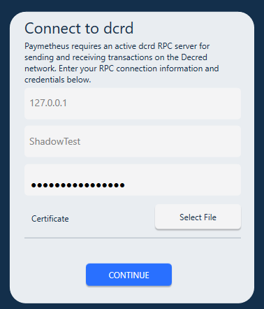

# **Paymetheus设置指南** #

Paymetheus是一款易于使用的Decred图形钱包。有了它，您可以发送和接收DCR，购买PoS用于[PoS选举](/mining/proof-of-stake.md)的选票，获取您所有交易的历史等等。Paymetheus不能做的唯一的事情是PoS投票。

---

## **下载并安装** ##

Windows Installer（`.msi`文件）位于此处：[https://github.com/decred/decred-binaries/releases/tag/v1.0.8](https://github.com/decred/decred-binaries/releases/tag/v1.0.8)。它将Paymetheus安装到您计算机的Program Files文件夹。安装非常简单，指令如下：

1. 下载正确的文件：

      对于32位计算机，请下载该`decred_1.0.8-release_x86.msi`文件。  
      对于64位计算机，请下载该`decred_1.0.8-release_x64.msi`文件。

2. 找到下载位置并双击该`.msi`文件。

3. 跟着安装步骤。在此过程中，您将被提示接受终端用户许可协议。

4. 安装完成后，程序应该安装到您的`..\Program Files\Decred\`文件夹，并可以通过开始菜单进行访问（在程序列表中查找`Decred`）

---

## **启动Paymetheus** ##
您现在可以开始使用Decred！启动“Decred”程序。您现在将看到连接截图：

>当您启动Decred时，两个程序实际上正在运行。“Paymetheus”是我们将进一步讨论的图形钱包;
>'dcrd'是真正与Decred网络交流的通信守护进程（发音为DAY-mon;一种在后台运行并且不直接与用户交互的程序）
>。这意味着您可以在另一台计算机上运行dcrd（例如始终在服务器上），然后使用Paymetheus远程连接它。

我们将使用Paymetheus已经开始的本地版本，所以只需按继续。

>Paymetheus第一次启动时，它将在后台下载区块链。这可能需要一个小时。

---

## **创建或还原电子钱包** ##
您现在可以选择创建新的钱包或从种子还原钱包。如果你正在阅读这里，你可能是新人，还没有钱包，所以让我们创建一个新的。如果单击还原，将被要求输入您的种子字，而不是被赋予一个新的种子。其余的过程是一样的。点击“Create a new wallet”。您将看到如以下截图所示：

<i class="fa fa-exclamation-triangle"></i>停在这里！！！不要点击继续！

**这是使用Decred的最重要的部分。您的种子字符串显示在白色框中。这个字符串是你的钱包的钥匙。**
**没有这些词组或十六进制字符串，您将永远永远失去您的资金！**

**不要给任何人，甚至Decred的开发者！**

有了这些词组，其他人可以在另一台电脑上重新创建你的钱包，并将所有资金转移到另一个钱包。在Decred中不可能扭转交易，所以如果有人偷走了您的Decred，将没有办法让它回来。

<i class="fa fa-exclamation-triangle"></i> **DO NOT USE THE SAME SEED IN MULTIPLE WALLETS! Visit [Wallets and Seeds FAQ](/faq/wallets-and-seeds.md#3-can-i-run-multiple-wallets) to see why this matters. It is recommended that where possible a new wallet should mean generating a new seed.**

**不要在多个电子钱包中使用相同的种子！访问[钱包和种子常见问题](/faq/wallets-and-seeds.md#3-can-i-run-multiple-wallets)，看看为什么这很重要。建议在可能的情况下，一个新的钱包意味着产生了一个新的种子。**

Decred和其他数字货币通常被描述为像一个银行账户。然而，与网络银行不同，在Decred系统中，没有可信任的第三方代表您持有您的钱。你单独控制你的DCR，就像物理现金一样。当现金或DCR丢失，放错或被盗时，很有可能永久性消失。

如果你失去了你的钱包，你将无法访问你所拥有的任何东西，没有任何人，即使是Decred的开发人员也也无法找回它。所以花时间阅读本页并将种子字组写在安全的地方是非常重要的。有一个好主意是：将它们写在一张纸上，然后存储在安全的地方，同时以加密文件的形式另外在计算机上存储一份。当还需要预防措施时，Dropbox或OneDrive等云端存储空间是一个好途径。然而由于在线帐户可能被黑客攻击，在将其上传到云端存储服务之前,您应该将您的钱包文件强力加密（MS Word或Libre / OpenOffice可以执行此操作）。

好的，现在你已经在至少两个不同的地方保存了你的种子词组。单击继续。您现在被要求重新输入，以确保您正确地写入它们，以备以后需要还原钱包。注意,您不能粘贴它们, 您必须要用手敲入它们。这是为了确保你把这些单词保存在剪贴板以外的地方。完成之后，然后单击确认。

---

## **选择私人钱包密码** ##
在网上创建交易时，输入密码即可使用。只要你的钱包没有这个密码解锁，即使某人控制了钱包文件也还是无法访问钱包。这里也有公共密码的选项。它用于加密您的钱包文件中的所有公共数据（交易和地址），如果被盗，对手无法将您和您的交易联系起来。对于大多数人来说，公共密码通常是多此一举，所以你可以不用管它。输入新的私人密码（和可选的公开密码）后，点击加密。

现在您的钱包将创建并同步到区块链。在较慢的电脑上可能需要几分钟的时间。请注意，您记下的种子字组将被用在所有Decred钱包应用程序上，而不仅仅是Paymetheus。

接下来是[使用Paymetheus](using-paymetheus.md)
